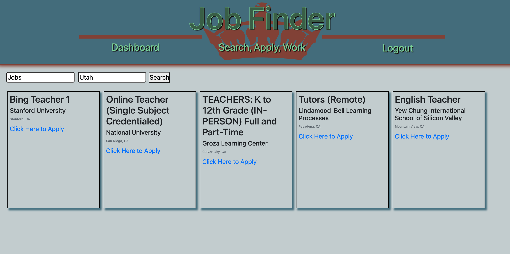

# job-finder

## Description

A fullstack application that uses the MVC pattern. The view is produced by handlebars.js, with an express server and a JawsDB database deployed through Heroku. This application allows users to create accounts and view and save jobs.

## Table of Contents

* [Installation](#installation)
* [Usage](#usage)
* [Credits](#credits)
* [License](#license)

## Installation

* copy source code
* run npm install
* run npm start

## Usage 

* Go to https://buzzword-job-finder.herokuapp.com/
* Create an account by providing a username, email, and password
* Search for jobs and save them to the dashboard

## Contributing

The code for this project was writtern by Jaydon Goodrich, Josh Miller, Jacob Wilde, Garrett Manwaring

## Tests

No tests are given for this app.

## License

Code released under the [Unlicense](http://unlicense.org/)

****
    
## Reference

[Link to Deployed Site](https://buzzword-job-finder.herokuapp.com/)

